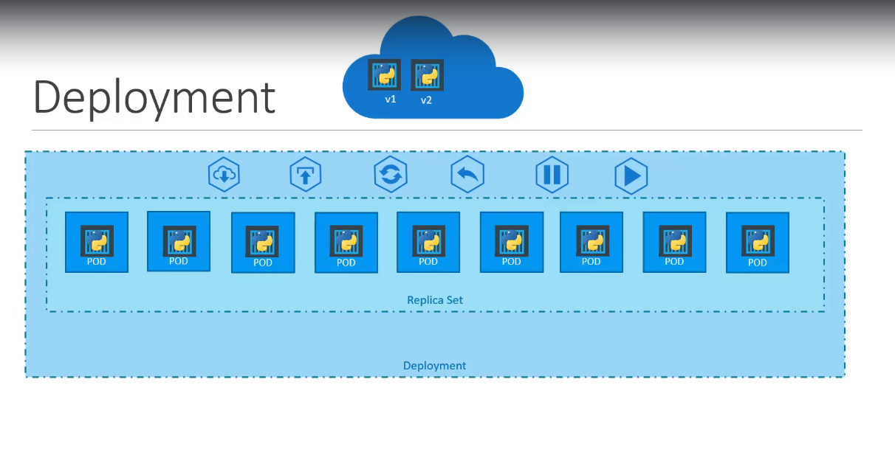
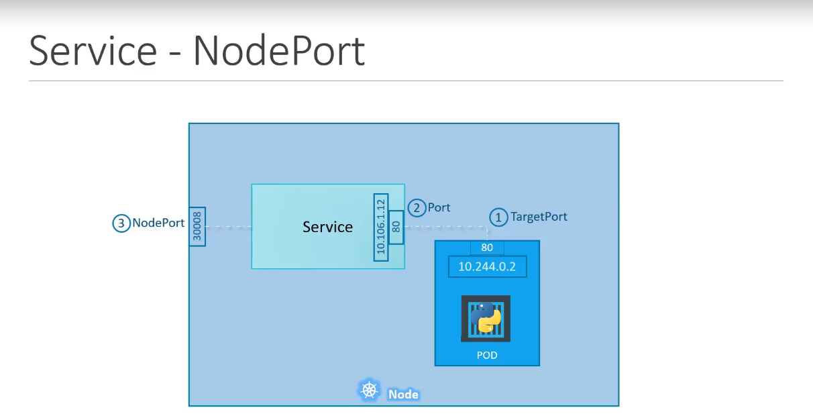
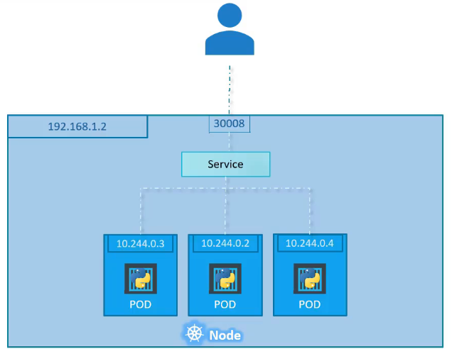
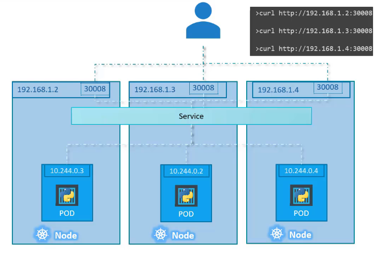
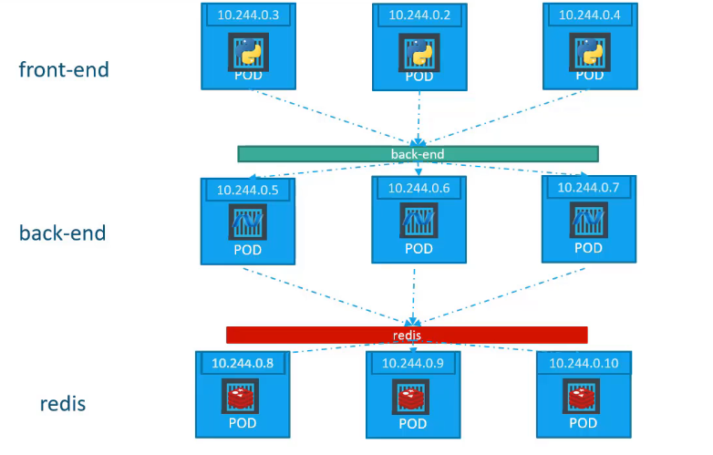
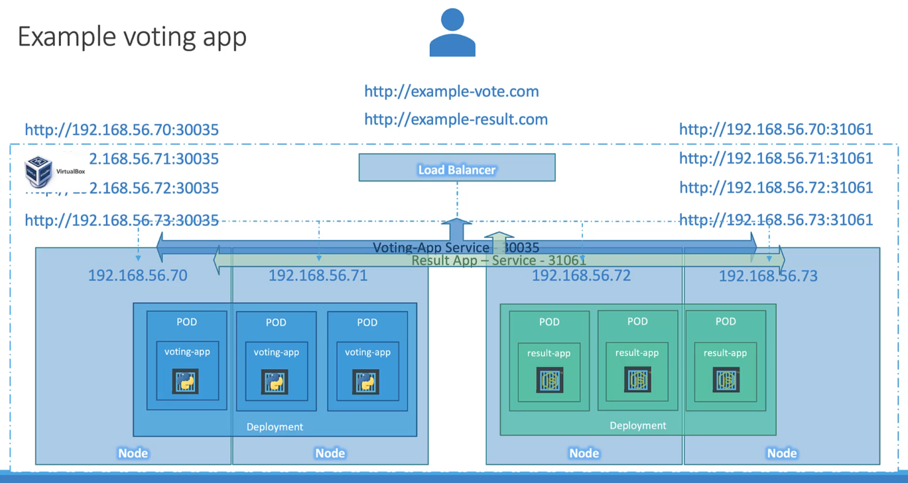
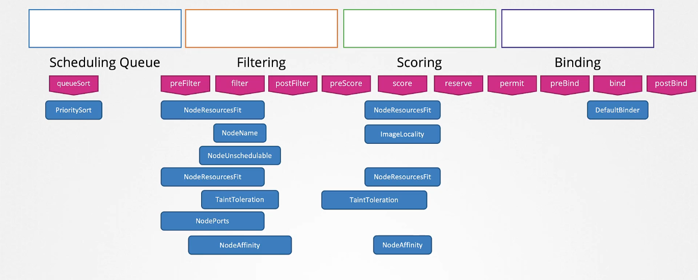
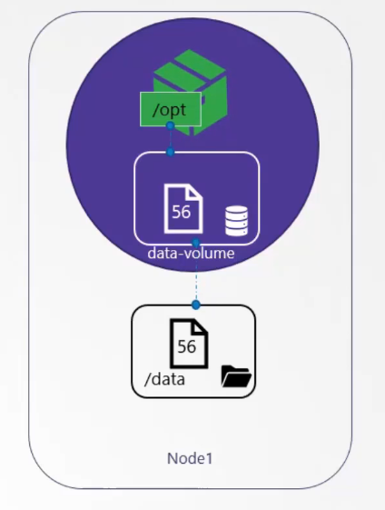
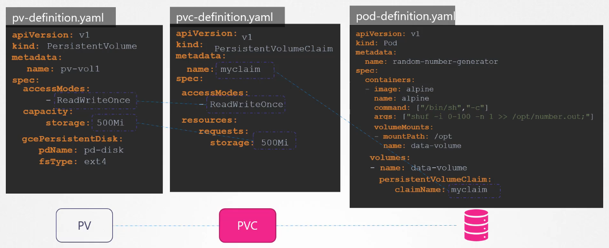

# Core concepts

`kubectl get all`

## Cluster Architecture
### ETCD
- ETCD is a NoSQL key-value storage similar to mongodb
- ETCD in kubernetes is a service which runs on the master nodes
- The ETCD data storage is used by Kubernetes to store info about Nodes, PODs, Configs etc. Every change made to the cluster updates the ETCD. 
- ETCDCTL is the CLI tool used to interact with ETCD. 

etcd.service:
- `--adversites-client-urls` address of the etcd instance (port 2379)
- If you have multiple masters you'll have multiple instances of the ETCD. ``--initial-cluster`` is where you must specify the address of other ETCD instances

### kube-api
- It's the primary management component in Kubernetes. Every `kubectl` command reaches the kube-apiserver
- It authenticates and validates the `kubectl` request.
- It's the only component which has direct access to the ETCD. 
- Get's used by the scheduler and the kubelet to report back information. 

Creation of a POD: 

1. `kubectl` or direct POST request to the kube-apiserver requesting an new POD
2.  the kube-apiserver authenticates, validates, updates the ETCD cluster with a new POD object with no node assigned
3. The kube-scheduler, which polls the kube-apiserver, realizes that there is a new POD but no node, finds a node for it and communicates it to the kube-apiserver
4. The kube-apiserver updates the ETCD cluster with the new information
5. The kube-apiserver passes information on the kubelet on the selected node
6. The kubelet on the node creates the POD and instructs the container runtime engine (Docker) to deploy the app image
7. The kubelet updates the status back to the kube-apiserver
8. The kubeapi-server then updates the ETCD cluster

kube-apiserver.service:
- `--etcd-cafile`, `--etcd-certfile` and `--etcd-keyfile` are set to paths to certificates to secure the connectivities between Kubernetes components
- `--etcd-servers` is the address for the etcd servers

kubeadmn deploys a kube-apiserver-master as a POD in the kube-system namespace on the master node. 

### kube-controller-manager
A controller in kubernetes is a process that continously monitors the state of various components in the system and works towards reaching a functioning state of the system. 

The Node-Controller is responsible for monitoring the state of the nodes and take the necessary actions to keep the applications running. It uses the kubeapi-server to poll the heartbeat of nodes. 

The Replication-Controller is responsible of replica sets. 

All Conrollers are packaged in a single process known as the Kube-Controller-Manager. 

kube-controller-manager.service:
- `--node-monitor-period` is the polling interval of kubeapi-server to check heartbeat of nodes
- `--node-monitor-grace-period` is the period the controller waits before marking a node unreachable
- `--pod-eviction-timeout` is the period the controller waits for the node to become alive again before moving the pod 

kubeadmn deploys a kube-controller-manager as a POD in the kube-system namespace on the master node. 

### kube-scheduler
Decides which POD goes on which node (doesnt actually deploy the PODs) depending on the resources needed by the POD. 

- Filter the nodes to the eligible ones
- Ranks the eligible nodes through a priority algorithm

kubeadmn deploys a kube-scheduler as a POD in the kube-system namespace on the master node. 

### kubelet
Theyre the contact points from workers to the master. 

A kubelet registers itelself to the master to join the cluster. Then each time it receives commands from the kube-apiserver it requests the container runtime engine (docker) to run the applications.

A kubelet then monitors the node and reports periodically to the kube-apiserver about the status of his node. 

kubelets are not automatically deployed by Kubeadm. They needto be downloaded and run as a process on the nodes. 

### kube-proxy
It's the networking solution between PODs. 

It's a process that runs on each node. Each time a new service is created it creates the appropriate rule on each node to forward traffic to the right backend node for the service, through ip-table rules.

kubeadmn deploys kube-proxy as PODs on each node. 

## API-primitives

### POD 
A pod is a single istance of an application, which might contain multiple containers. A pod is the smallest item in kubernetes. Containers between a POD can communicate using localhost.

- `kubectl run nginx --image nginx` deploys a POD with the image nginx
- `kubectl get pods`
- `kubectl describe pod nginx`
- `kubectl delete pod nginx`
- `kubectl apply -f pod.yml` 
    ```
    apiVersion: v1
    kind: Pod
    metadata:
        name: nginx
        labels: 
            app: nginx
            tier: frontend
    spec:
        containers:
            - name: nginx
              image: nginx
            - name: busybox
              image: busybox
    ```

### ReplicaSets
The ReplicaSet is a process that monitors the pods. 

The create command will create as many pods as specified in `replicas` with the defined `template`.
- `kubecl create -f rec-definition.yml`
    ```
    apiVersion: apps/v1
    kind: ReplicationController
    metadata:
        name: myapp-rc
        labels: 
            app: myapp
            tier: frontend
    spec:
        template:
            metadata:
                name: nginx
                labels: 
                    app: nginx
                    tier: frontend
            spec:
                containers:
                    - name: nginx
                    image: nginx
                    - name: busybox
                    image: busybox
        replicas: 3
        selector:
            matchLabels:
                type: frontend
    ```
    The template is how the pods which will be part of the replication-controller will be defined. 
- `kubectl get replicaset myreplica`

ReplicationController and ReplicaSet are basically the same thing, but ReplicaSet has the `selector` attribute, which uses `matchLabels` to match already existing pods to count as part of the Replicaset. 

The labels assigned in the definition of a pod can be matched through a selector matchLabels of a ReplicaSet and the eplicaset process will monitor those PODs. 
- `kubectl delete replicaset myapp-replicaset`, deletes all PODs in myapp-replicaset
- `kubectl replace -f replicaset-definition.yml` 
and we change the replicas to 6
- `kubectl scale --replicas=6 -f replicaset-definition.yml`, NB: won't change the actual number on the file
- `kubectl scale --replicas=6 replicaset(TYPE) myapp-replicaset(NAME)`, scale the replicaset by command-line
- `kubectl edit replicaset new-replica-set`

### Deployments
A deployment is a concept which encapsulates ReplicaSets (which encapsulate multiple PODS). A deployment through the `replicas` automatically creates a ReplicaSet


- `kubectl create -f deployment-definition.yml`
    ```
    apiVersion: apps/v1
    kind: Deployment
    metadata:
    name: myapp-deployment
    labels: 
        app: myapp
        tier: frontend
    spec:
        template:
            metadata:
            name: myapp-pod
            labels: 
                app: my-app
                tier: frontend
            spec:
            containers:
            - name: nginx-container
              image: nginx
        replicas: 3
        selector:
            matchLabels:
                tier: frontend
- `kubectl get deployments`

## Services

Services help connect applications togheter, to external sources and to users. 

### NodePort Service
Given a node we can set a NodePort service to listen for requests on the port node-ip:30008 and incoming forward requests on that port to the right PODs (yes, even multiple) residing inside the node.



- `kubectl create -f service-definition.yml`
    ```
    apiVersion: v1
    kind: Service
    metadata:
        name: myapp-service
    spec: 
        type: NodePort
        ports:
            - targetPort: 80
              port: 80
              nodePort: 30008
        selector: (to target the pods)
            app: myapp
            type: front-end
    ```
- `kubectl get services`

A service can include multiple PODs on a single node.



Or can include multiple PODS on multiple nodes (no additional configuration) making them available on the same port for all nodes.


The Load balancing algorithm for chosing the resources to forward requests to is Random. In case any of the nodes or PODs get removed from the cluster the service will update itself without the need of additional actions. 

### ClusterIP
A clusterIP service is used to create an internal static ip to create a unique interfact to access set of PODs (which are dynamic, and could die and get recreated and change IP) running a service. 
- `kubectl create -f service-definition.yml`
    ```
    apiVersion: v1
    kind: Service
    metadata:
        name: back-end
    spec: 
        type: ClusterIP
        ports:
            - targetPort: 80 (port of pods exposing their app)
              port: 80 (port of the service exposing the back-end service)
        selector: (to target the pods)
            app: myapp
            type: back-end
    ```
- `kubectl get services`


### LoadBalancer
Used to setup a single point of contact towards external users with internal services. This service only works on cloud providers which have a native loadbalancer. 
- `kubectl create -f service-definition.yml`
    ```
    apiVersion: v1
    kind: Service
    metadata:
        name: myapp
    spec: 
        type: LoadBalancer
        ports:
            - targetPort: 80 (port of pods exposing their app)
              port: 80 (port of the service)
              nodePort: 30008
        selector: (to target the pods)
            app: myapp
            type: webapp
    ```
- `kubectl get services`


## Namespaces
Namespaces are way to isolate resources. When we create a resource kubernetes creates is  in the `default` namespace or we can specify it in metadata or in the commandline `kubectl create -f def.yml --namespace=dev`
```
apiVersion: v1
kind: Service
metadata:
    namespace: dev
    name: myapp
spec: 
    type: LoadBalancer
    ports:
        - targetPort: 80 (port of pods exposing their app)
            port: 80 (port of the service)
            nodePort: 30008
    selector: (to target the pods)
        app: myapp
        type: webapp
```
Kubernetes creates resources needed to run the cluster in `kube-system`.
The full name of a resource in the DNS when created is `resourcename.namespacename.svc.cluster.local`.

To create a namespace `kubectl create namespace dev` or
- `kubectl create -f namespace-dev.yml`
```
apiVersion:v1
kind: Namespace
metadata:
    name: dev
```

- To switch namespace `kubectl config set-context $(kubectl config current-context) --namespace=prod`

We can limit resources for a certain namespace through a ResourceQuota:
```
apiVersion: v1
kind: ResourceQuota
metadata:
    name: compute-quota
    namespace: dev
spec:
    hard:
        pods: "10"
        requests.cpu: "4"
        requests.memory: 5Gi
        limits.cpu: "10"
        limits.memory 10Gi
```

- `kubectl get pods --all-namespaces`

## Imperative commands

- If you simply want to test your command , use the `--dry-run=client` option. This will not create the resource, instead, tell you whether the resource can be created and if your command is right.

- `-o yaml`: This will output the resource definition in YAML format on screen.

Imperative: 
- `kubectl run --image=nginx nginx`
- `kubectl create deployment --image=nginx nginx`
- `kubcetl expose deployment nginx --port 80`
- `kubectl edit deployment nginx`
- `kubectl scale deployment nginx --replicas=5`
- `kubectl set image deployment nginx nginx=nginx:1.18`
- `kubectl label pod podname type=db`

## Declarative commands

Declarative:
-`kubectl apply -f nginx.yml`

When we use the apply command the last applied configuration is stored on the Kubernetes Live Object Condiguration as a field. 

# Scheduling

The scheduler looks for PODs that don't have the `nodeName` property set, which means theyre not on a node yet and that their state is `Pending`, and assigns them one and updates the field. 

## Manual scheduling

Kubernetes wont allow the user to modify the `nodeName` of a POD, so you have to create a `Binding` object with a target node, this will create a POST request to the POD binding API, just like the scheduler would. 

```
apiVersion: v1
kind: Binding
metadata:
    name: nginx
target:
    apiVersion: v1
    kind: Node
    name: node02
```

## Labels and Selectors

- `kubectl label node node01 color=blue`

- Under `metadata` in a definition you can set the parameter `labels:` and then specify tuples of labels (`app: App1` or `group: front-end`)

    `kubectl get pods --selector app=App1` will return pods tagged with `app` as `App1`

- When creating a `ReplicaSet` you can define the labels of the ReplicaSet istance under `metadata` and under `template`>`metadata` you will define the labels of the pods that the ReplicaSet will include. The `selector`>`matchLabels`, which will actually find the pods, setting will be set the same as the labels of the template.

- The `annotations` tuples will be used for general info on the object such as `buildversion: 1.34`

## Taints and Tolerations
A mechanism to guide the scheduler in deciding which PODs can't be placed on which nodes. 

- `taints` are for nodes, `tolerations` are for PODs

We can `taint` a certain node and only PODs which are `tolerant` to that taint can be allocated on it. 

- `kubectl taint nodes node_name app=blue:taint_effect`

the `taint effect` describe what happens to pods when they dont tolerate the taint
- `NoSchedule`: PODs will not be scheduled on the node
- `PreferNoSchedule`: try to avoid scheduling PODs on that node if possible
- `NoExecute`: no new PODs and already scheduled get evicted if they don't tolerate

to set the toleration on a POD for to the taint descripeted in the above command:
```
apiVersion: v1
kind: Pod
metadata:
    name: myapp-pod
spec:
    containers:
        - name: nginx-container
          image: nginx
    tolerations:
        - key: "app"
          operator: "Equal"
          value: "blue"
          effect: "NoSchedule"
```

The `master` node only runs management software, when the cluster is created the `master` node is tainted by the scheduler in order not to place any application load on it. 

## Node selectors
Easier way to select on which Node will a PODs run, other way is Affinity.

This pod will be placed on the Node `node01`

node:
- `kubectl label nodes node01 size=Large`

pod:
```
apiVersion: v1
kind: Pod
metadata:
    name: myapp-pod
spec:
    containers:
        - name: nginx-container
          image: nginx
    nodeSelector:
        size: Large
```

## Node affinity
Operationwise way to influence PODs scheduling on nodes.

```
apiVersion: v1
kind: Pod
metadata:
    name: myapp-pod
spec:
    containers:
        - name: nginx-container
          image: nginx
    affinity:
        nodeAffinity:
            requiredDuringSchedulingIngoredDuringExecution:
                nodeSelectorTerms:
                    - matchExpressions:
                        - key: size
                          operator: In (can be also NotIn)
                          values: 
                            - Small
                            - Medium
```

The affinity type, defines the behaviour of the scheduler can be:
- `requiredDuringSchedulingIngoredDuringExecution`
- `preferredDuringSchedulingIgnoredDuringExecution`
- `requiredDuringSchedulingRequiredDuringExecution`

## Resource requirements and limits
If no node has sufficient resources to deploy a certain POD it will be stuck in `pending` state and the `Events` will have a `Failedscheduling` alert describing the reason. 

Lowest amount of CPU you can be `0.1`. `1` CPU equals to one AWS vCPU.
Memory can be specified with letters `1Gi` is a Gibibyte.

Resources can be limited, default CPU value is 1 vCPU and 512 Mi, 

You can describe the `Resource Request` and the `Resource Limit` of POD in its definition (the limits will be set for each container in the POD).
```
apiVersion: v1
kind: Pod
metadata:
    name: myapp-pod
spec:
    containers:
        - name: nginx-container
          image: nginx
    resources:
        requests:
            memory: "1Gi"
            cpu: 1
        limits:
            memory: "2Gi"
            cpu: 2
```

If a container tries to use more than his limit for CPU it gets throttled. 
If a container consumes more memory than its limit it gets terminated.

A `LimitRange` object can be defined to give a default value, if not otherwise specified, for resource limits for certain type of objects.

```
apiVersion: v1
kind: LimitRange
metadata:
    name: mem-limit-range
spec:
    limits:
    - default:
        memory: 512Mi
    defaultRequest:
        memory: 256Mi
    type: Container
```

### Note: Editing PODs and Deployments
Remember, you CANNOT edit specifications of an existing POD other than the below.

    spec.containers[*].image

    spec.initContainers[*].image

    spec.activeDeadlineSeconds

    spec.tolerations

For example you cannot edit the environment variables, service accounts, resource limits (all of which we will discuss later) of a running pod. But if you really want to, you have 2 options:

1. Run the kubectl edit pod <pod name> command.  This will open the pod specification in an editor (vi editor). Then edit the required properties. When you try to save it, you will be denied. This is because you are attempting to edit a field on the pod that is not editable. 

A copy of the file with your changes is saved in a temporary location as shown above.

You can then delete the existing pod by running the command:

kubectl delete pod webapp


Then create a new pod with your changes using the temporary file

kubectl create -f /tmp/kubectl-edit-ccvrq.yaml


2. The second option is to extract the pod definition in YAML format to a file using the command

kubectl get pod webapp -o yaml > my-new-pod.yaml

Then make the changes to the exported file using an editor (vi editor). Save the changes

vi my-new-pod.yaml

Then delete the existing pod

kubectl delete pod webapp

Then create a new pod with the edited file

kubectl create -f my-new-pod.yaml 

Edit Deployments

With Deployments you can easily edit any field/property of the POD template. Since the pod template is a child of the deployment specification,  with every change the deployment will automatically delete and create a new pod with the new changes. So if you are asked to edit a property of a POD part of a deployment you may do that simply by running the command

kubectl edit deployment my-deployment 

## Daemon Sets
Handled by the daemonsets controller.

A daemon set runs a copy of your POD on each node in the cluster. When a new node gets added the POD gets replicated on it. 

Use cases for a Daemon Set are Monitoring Software and Logs Viewers. A `kube-proxy` is an example of something that would be in a `DaemonSet`, Networking Solutions are another use case. 

```
apiVersion: apps/v1
kind: DaemonSet
metadata:
    name: monitoring-daemon
spec:
    selector:
        matchLabels:
            app: monitoring-agent
    template:
        metadata:
            labels:
                app: monitoring-agent
        spec:
            containers:
                - name: monitoring-aget
                  image: monitoring-agent
```
A DaemonSet uses the default scheduler and node affinity to schedule pods on nodes. 

## Static Pods
The Kubelet (which resides on all worker nodes) relies on the kube-api-server for instructions on what PODs to load on its node, which is based on a decision made by the kube scheduler, decision which was stored in the ETCD data store.

But a kubelet can create PODs without the API-server through the manifests placed on his node in his `/etc/kubernetes/manifests` folder. It polls this folder for changes on this manifests. This pods are `Static Pods`; you can only create PODs this way, other structures would require the whole Kubernetes architecture to work. 

The option for setting this folder path on the node can be passed to the kubelet.service file through `--pod-manifest-path=`. Another way to do it is to pass the `--config=` file with a set `staticPodPath:`.

These `Static pods` will be viewable from the kube-api-server because the kubelet will communicate a read only mirror of its state; can't operate on them though. 

An use case: You can depoy the control plane components itself as pods on a node using static pods, by using the docker images of those components. 
These pods will be handled by the kubelet and restarted when crashed autonomously. This is how the kube-admin-tool sets up a Cluster, infact the kube-system namespace has the control plane components as pods. 

A way to figure out if a POD is a `Static Pod` is look at it yaml (get with `-o yaml`) definition in the file `ownerReferences`, if the `kind` is `Node` then it's a static pod.
A weaker way is that all static pods will have `-<the_name_of_the_node_its_hosted_on>` at the end of its name 

## Multiple Schedulers
When one wants to have its own scheduling algorithm. A cluster can have multiple schedulers and you can mark the pods to be scheduled by a certain scheduler. 
In the POD definition:
```
...
spec:
    containers:
    - image: nginx
      name: nginx
    schedulerName: my-custom-scheduler
```


The scheduler created by kubernetes is `default-scheduler`. 
Deploy the scheduler as a POD:
my-custom-scheduler.yml
```
apiVersion: v1
kind: Pod
metadata:
    name: my-custom-scheduler
    namespace: kube-system
spec: 
    containers:
        - command:
            - kube-scheduler
            - --address=127.0.0.1
            - --kubeconfig=/etc/kubernetes/scheduler.conf
            - --config=/etc/kubernetes/my-scheduler-config.yaml

            image: k8s.gcr.io/kube-scheduler-amd64:v1.11.3
            name: kube-scheduler
```
my-scheduler-config.yaml:
```
apiVersion: kubescheduler.config.k8s.io/v1
kind: KubeSchedulerConfiguration
profiles:
    - schedulerName: my-scheduler
leaderElection:
    leaderElect: true
    resourceNamespace: kube-system
    resourceName: lock-object-my-scheduler
```

To see the schedulers working, look for the `Scheduled` events
```
kubectl get events -o wide
```
or look at the logs of each single scheduler
```
kubectl logs my-custom-scheduler --name-space=kube-system
```
## Scheduler Profile
When the PODs are created they wait for the scheduler in a scheduling queue, sorted by the priority defined on the PODs. This is called ``scheduling phase``.
```
...
spec:
    priorityClassName: high-priority
```
high-priority-class.yaml
```
apiVersion: v1
kind: PriorityClass
metadata:
    name: high-priority
value: 100000
globalDefault: false
description: "This class should be used for XYZ pods"
```
Then they pass on to the ``filtering phase`` where the nodes that can't host that pod get filtered out. 

The next phase is the ``scoring phase`` where each suitable node gets assigned a score based on the amount of resources that would remain available after hosting the pod. The more resources remaining the more we prefer it. 

All of these phases are executed by certain plugins (blue shapes):


For each of those phases we have multiple extension points (the pink shapes) that permits us to write our own plugin and use them.

To avoid race conditions and avoid having the hassle of having to manage each binary singurarly we define them in the same `KubeSchedulerConfiguration`:
```
apiVersion: kubescheduler.config.k8s.io/v1
kind: KubeSchedulerConfiguration
profiles:
    - schedulerName: my-scheduler-2
        plugins:
            score:
                disabled:
                    - name: TaintToleration
                enabled:
                    - name: MyCustomPluginA
                    - name: MyCustomPluginB
    - schedulerName: my-scheduler-3
        plugins:
            preScore:
                disabled:
                    - name: '*'
            score:
                disabled:
                    - name: '*'
    - schedulerName: my-scheduler-4
...
```

# Logging and Monitoring

## Monitoring the cluster

We want to know node-level metrics such as, how many nodes are in the cluster, how many healthy and performance metrics such as cpu, memory, disk and network utilization. As well as pod-level metrics such as the cpu and memory consumption. 

We need a solution which monitors, stores and provides analytics around these metrics. 
The `Metrics server` retrieves metrics from each node, aggregates them and stores them. This is only done in-memory, no historical data is saved; if we want longterm storing we need an external solution.

The `kubelet` has a component called the `cAdvisor` which is responsible for retrieving metrics at pod-level, exposes them to the `kubelet` which in turn exposes them to the `Metrics Server`.

The `Metrics Server` has to be cloned from git and his resources created.
Then cluster performances can be viewed with `kubectl top node` and `kubectl top pod`.

## Application level logs

``kubectl logs -f <pod_name> <container_name>``

# Storage

## Docker Storage

- Storage Drivers
```
/var/lib/docker
|-- aufs
|-- containers
|-- images
|-- volumes
```

Common docker persistent volumes.

- Volume Drivers

Persistent volumes in the cloud. 

## Container Storage Interface
Since the container runtime engine is not just Docker anymore now Kubernetes has a CRI (container runtime interface) so that Kubernetes can comunicate with every container engine which follows the specification. 
Similarly we have a CNI (container network interface). 

And CSI (container storage interface). It defines a set of RPC (remote procedures calls) which are used by the orchestrator and implemented by the storage driver. 

## Volumes in Kubernetes 
You can define a volume of a POD to be a directory in the node so that files remain even when the container in the pod dies. 
```
apiVersion: v1
kind: Pod
metadata:
    name: random-number-generator
spec: 
    containers:
    - image: alpine
      name: alpine
      command: ["/bin/sh","-c"]
      args: ["shuf -i 0-100 -n 1 >> /opt/number.out"]
      volumeMounts:
      - mountPath: /opt
        name: data-volume
    
    volumes:
    - name: data-volume
      hostPath:
        path: /data
        type: Directory
```


This isn't recommended because it's not scalable, other nodes won't have access to this folder. The recommended solution is to use a distributed storage cluster solution. 
```
...
volumes:
    - name: data-volume
    awsElasticBlockStore:
        volumeID: <volume-id>
        fdType: ext4
```

## Persistent volumes
We would like to extract the storage config from the pod definition and manage storage centraly. 

A persistentVolume is a limited definition of a Volume. 
```
apiVersion: v1
kind: PersistentVolume
metadata:
    name: pv-vol1
spec:
    accessMode:
        - ReadWriteOnce
    capacity:
        storage: 1Gi
    awsElasticBlockStore:
        volumeID: <volume-id>
        fsType: ext4
```


## Persistent volume claims (PVC)
An administrator creates PVs (persistent volumes) and users which deploy nodes create PVCs (persistent volume claims).

Kubernetes binds volumes and claims based on the claim request specifics and the properties of the actual volumes. 

Requests and properties characteristics to be matched are Sufficient Capacity, Access Modes, Storage Classes. These matches are automatic, but if there are more than one suitable PV for a PVC `selectors` can always be set. 

PVCs and PV have a 1:1 relationship so if a PVC is set on a PV which has bigger space than requested, that space can't be used by any other PVC. If there are no PVs available the PVCs will remain in the ``Pending`` state.
```
apiVersion:v1
kind: PersistentVolumeClaim
metadata:
    name: myclaim
spec: 
    accessModes:
        - ReadWriteOnce
    resources: 
        requests:
            storage: 500Mi
```
With the command `kubetcl get persistentVolumeClaim` we can see the status of the PVC and to which volume it has been bound.

What happens to the volume after the PVC is deleted is set through `persistentVolumeReclaimPolicy` if set to `Retain` the volume stays up until an admin deletes is but is not usable by other PVCs; when set to `Delete` it gets deleted as soon as the PVC bound to it gets deleted. The third option is  `Recycle` the PV will be available to other PVCs and the data will be scrubbed. 

To use a PVC in a pod, deployment or replicaSet define a volume mount for the container and then in the `volumes` section define the PVC used.
```
    apiVersion: v1
    kind: Pod
    metadata:
      name: mypod
    spec:
      containers:
        - name: myfrontend
          image: nginx
          volumeMounts:
          - mountPath: "/var/www/html"
            name: mypd
      volumes:
        - name: mypd
          persistentVolumeClaim:
            claimName: myclaim
```



## Storage Classes 

When defining PVs the storage resource referenced has to be existing. 
A `storage-class` is used to automatically provision the storage resources on the cloud provider when defining a PV. 
```
apiVersion: storage.k8s.io/v1
kind: StorageClass
metadata:
    name: google-storage
provisioner: kubernetes.io/gce-pd
parameters:
    type: pd-standard
    replication-type: none
```

If we use a `Storage Class` there is no longer the need for defining PVs since they will be created and provisioned on the cloud provider automatically when a PVC is created. 

To use a Storage Class in a PVC set the `storageClassName` to the name of the Storage Class defined.

Through the `parameters` it is possible to define different classes of storage, like hd-based, ssd-based, replicated. 

# Networking

## pre-req Network Namespaces
Are used by containers to implement network isolation. A single container only sees the processes in its namespace. 

## CNI (Container network interface)
When working with docker as a container engine, since it doesnt implement the CNI, Kubernetes will create a container with `--network=none` and then call the CNI plugin `bridge add <container-name> <network-namespace-name>`

## Cluster networking
Each node in a cluster must have at least an interface connected to a network, each interface must have an address. Each host must have an unique hostname and a unique MAC address. 

The master node has to accept connections on the `6443` port for the Kube-api, the kube-scheduler `10259`, etcd `2379` and the kube-controller-manager `10257`.

The worker nodes have the kubelet listening on the `10250` and the services get served on the range `30000-32767`.  

## DNS in the cluster (CoreDNS)
Deployed as two pods as part of ReplicaSet inside a Deployment. The pods run the CoreDNS executable and uses the `Corefile` for configs. To set CoreDNS to work with kubernetes we set the `kubernetes` plugin in the Corefile. The Corefile is passed in to the pod as a `ConfigMap` object, so if we need to modify its config we edit the ConfigMap object.

The pod will monitor the cluster and create or delete records when services (and if set, pods too) get created or deleted. 

When CoreDNS is deployed a service is created called `kube-dns`; the IP address of this service is configured as `nameserver` by the kubelet inside pods at creation time. 

## Ingress
A service NodePort can only allocate high numbered ports, which are difficult for users to remember. So then, to avoid users having to write your port to access your service, you place a proxy-server in front of your service which can be accessed on port `80`, you then point your DNS to your server; this is what you would do when your service is hosted on-premise. 

If you're using a cloud provider such as GCP, instead of a NodePort you create a LoadBalancer on an high port and the access proxy gets automatically created by GCP at the creation of the kubernetes LoadBalancer. The GCP LoadBalancer will have an external ip to which your DNS will point. 

An ingress is a single point of access for users to a Kubernetes application using a single URL which can be configured to route traffic (and loadbalance it) to different services within the cluster based on the URL path, and handle SSL security. An ingress still needs to be published to the outside through a NodePort service. 

An Ingress is made of an `Ingress Controller` (nginx, or some other reverse proxy) and `Ingress Resources` (rules in a definition file).
An Nginx `Ingress Controller` would not be a normal Nginx istance, but since its native in Kubernetes it would have additional intelligence of monitoring the cluster and updating the nginx conf when new resources appear.

### Ingress Controller
Note the special nginx image build:
```
apiVersion: extensions/v1beta1
kind: Deployment
metadata:
    name: nginx-ingress-controller
spec:
    replicas: 1
    selector:
        matchLabels:
            name: nginx-ingress
    template:
        metadata:
            labels:
                name: nginx-ingress
        spec:
            containers:
                - name: nginx-ingress-controller
                  image: quay.io/kuberntes-ingress-controller/nginx-ingress-controller:0.21.0
            args:
            - /nginx-ingress-controller
            - --configmap=$(POD_NAMESPACE)/nginx-configuration
            env:
                - name: POD_NAME
                  valueFrom:
                    fieldRef:
                        fieldPath: metadata.name
                - name: POD_NAMESPACE
                  valueFrom:
                    fieldRef:
                        fieldPath: metadata.namespace
            ports:
                - name: http
                  containerPort: 80
                - name: https
                  containerPort: 443
```
In order to have the nginx configs decoupled from the nginx declaration you must create a ConfigMap resource. 
```
kind: ConfigMap
apiVersion: v1
metadata:
    name: nginx-configuration
```
Then we need a NodePort service to expose the deployment to the outside:
```
apiVersion: v1
kind: Service
metadata:
    name: nginx-ingress
spec: 
    type: NodePort
    ports:
    - port: 80
      targetPort: 80
      protocol: TCP
      name: http
    - port: 443
      targetPort: 443
      protocol: TCP
      name: https
    selector: 
        name: nginx-ingress
```

In order for the Ingress to monitor and adjeust itself to changes in the cluster we must create a `ServiceAccount` with the right permission bindings.
```
apiVersion: v1
kind: ServiceAccount
metadata:
    name: nginx-ingress-serviceaccount
```
### Ingress Resource
An ingress resource is a set of rules or configurations which is applied to the ingress controller. 
An example of rule would be to forward all incoming traffic to a certain application, or on different applications based on the URL (or on the domain name).
```
apiVersion: extensions/v1beta1
kind: Ingress
metadata:
    name: ingress-wear
spec:
    rules:
        - http:
            paths:
                - path: /wear
                  pathType: Prefix
                    backend:
                      service:
                        name: wear-service
                        port:
                            number: 80
                - path: /watch
                    backend:
                        service:
                        name: wear-service
                        port:
                            number: 80
```

You would have a single rule for each domain you want to handle, and then inside the rule you handle the URL.
When a user tries to access any URL which is not in these rules it will get directed to the `Default backend` service, so you must remember to have one existing.

To handle domains:
```
rules:
    - host: wear.my-online-store.com
      http:
        paths:
          - backend:
                service:
                    name: wear-service
                    port:
                        number: 80
    - host: watch.my-online-store.com
      http:
        paths:
          - backend:
                service:
                    name: watch-service
                    port:
                        number: 80
```

In an `Ingress Resource` the annotation: 
```
...
    annotations:
        nginx.ingress.kubernetes.io/rewrite-target: /
```
Will rewrite whatever is under the `path:` parameter in order to achieve `http://<ingress-service>:<ingress-port>/watch` --> `http://<watch-service>:<port>/watch`. The underlying application will receive the path as `/` instead of `/pay`.